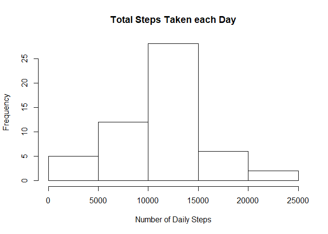
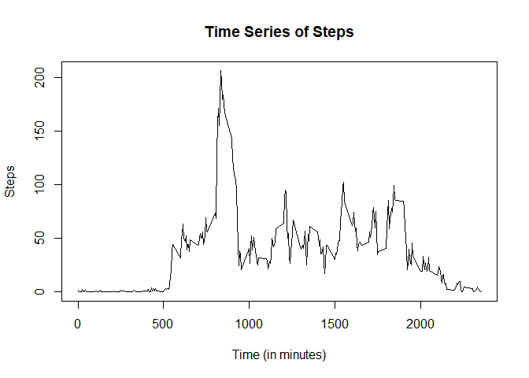
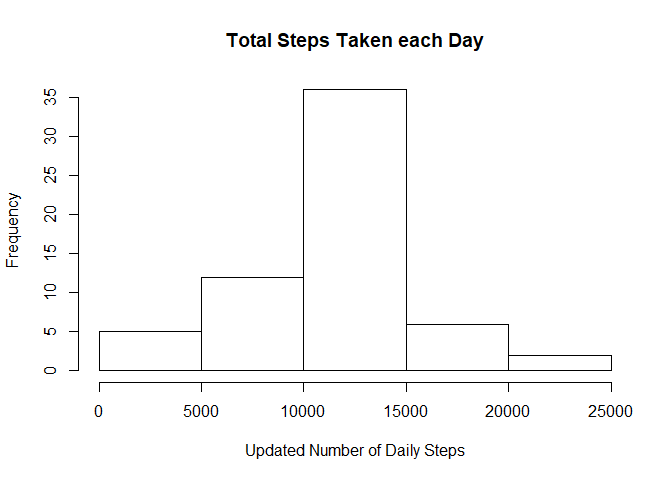
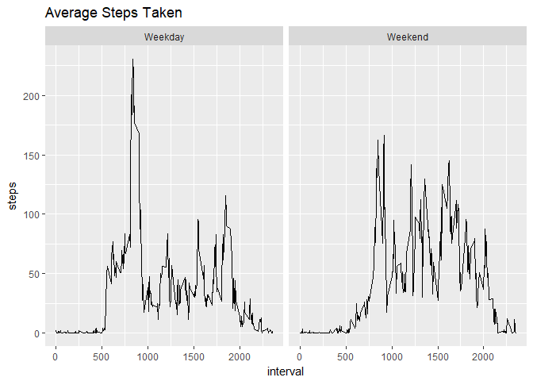

## Loading and preprocessing the data

```r
unzip("./activity.zip")
activity <- read.csv("./activity.csv")
```


## What is mean total number of steps taken per day?


```r
actbydate <- tapply(activity$steps, activity$date, sum)
hist(actbydate, main="Total Steps Taken each Day", xlab="Number of Daily Steps")
```

<!-- -->

```r
meansteps <- mean(actbydate, na.rm = TRUE)
mediansteps <- median(actbydate,na.rm = TRUE)
```

The mean total steps taken each day is 1.0766189\times 10^{4} and the median total steps taken each day is 10765.

## What is the average daily activity pattern?

```r
library('dplyr')
```

```
## 
## Attaching package: 'dplyr'
```

```
## The following objects are masked from 'package:stats':
## 
##     filter, lag
```

```
## The following objects are masked from 'package:base':
## 
##     intersect, setdiff, setequal, union
```

```r
actbyint<-activity %>% 
    group_by(interval)%>%
    summarise(steps=mean(steps,na.rm = TRUE))

plot(x=actbyint$interval, y=actbyint$steps, type = "l", main="Time Series of Steps",
     xlab='Time (in minutes)',ylab='Steps')
```

<!-- -->

```r
max <- max(actbyint)
maxint <- which(actbyint==max(actbyint))
```
The interval 288 contains the maxium average number of steps at 2355 steps. 

## Imputing missing values


```r
amtNA <- sum(is.na(activity))
```

In the original dataset there are 2304 missing data points.To remove these missing data points, I will replace the unknown values with the mean of the corresponding interval. 


```r
newactivity <- activity

for(i in 1:nrow(newactivity)){
    if(is.na(newactivity[i,1])){
        
        #Look up mean for interval from actbyint table from previous problem         and replace it.
        newactivity[i,1] = actbyint[which(actbyint$interval == newactivity[i,3]), 2]
    }
} 
newactbydate <- tapply(newactivity$steps, newactivity$date, sum)
hist(newactbydate, main="Total Steps Taken each Day", xlab="Updated Number of Daily Steps")
```

<!-- -->

```r
newmeansteps <- mean(newactbydate)
newmediansteps <- median(newactbydate)
```


After updating the data by replacing the missing data with the mean for the interval for the given missing data, the new mean is 1.0766189\times 10^{4} steps and the new median is 1.0766189\times 10^{4} steps.The mean for the original dataset and the updated data set is the same. The median is slightly lower for the updated data. Since I had used the average number of steps for a given interval for the missing data points, it did not change the average.

## Are there differences in activity patterns between weekdays and weekends?


```r
newactivity$PartOfWeek <- NA
newactivity$date<-as.Date(newactivity$date)
for(i in 1:nrow(newactivity)){
    if(weekdays(newactivity[i,2])=='Sunday' || weekdays(newactivity[i,2])=='Saturday'){
        newactivity[i,4] = 'Weekend'
    }
    else{
        newactivity[i,4]='Weekday'
    }
} 


library('ggplot2')
```

```
## Warning: package 'ggplot2' was built under R version 3.4.4
```

```r
ggplot(newactivity, aes(x=interval, y=steps))+
    stat_summary(fun.y=mean, geom='line')+facet_grid(~PartOfWeek)+
    ggtitle('Average Steps Taken')
```

<!-- -->
